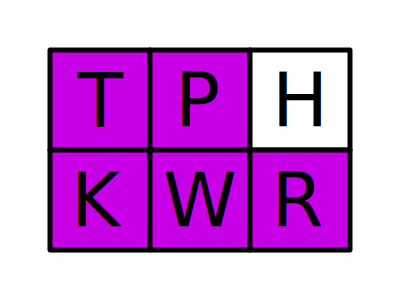
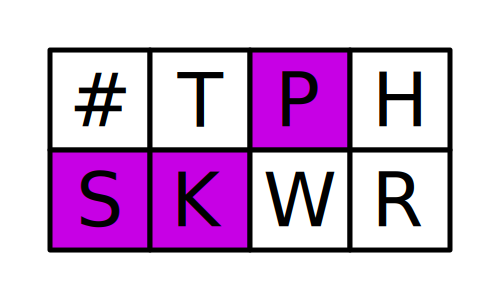
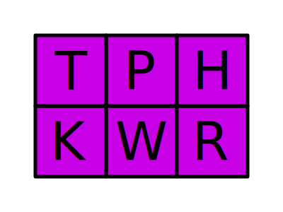

# dublU's Symbol Dictionary

This is dictionary that combines Emily's Modifier Dictionary and Emily
s Symbol Dictionary so that they work the same way. Check those dictionaries out here:

-   [Emily's Symbol Dictionary](https://github.com/EPLHREU/emily-symbols)
-   [Emily's Modifier Dictionary](https://github.com/EPLHREU/emily-modifiers)

## Design

This dictionary was created with the following goals in mind:

-   Have a consistent method to type (pretty much) every symbol
-   Specify spacing and capitalisation of that symbol in 1 stroke
-   Hackable and understandable to anyone who finds it useful :)

## Sections

To support the design goals, for each symbol there are 6 different options specifiable in sections of each stroke:

1. Capitalisation (Teal)
2. Symbol (Purple)
3. Variant (Magenta)
4. Repetition (Blue)
5. Spacing (Yellow)
6. Modifier (Green)
7. Ending (Orange/Red)

These options are mapped to different sections of the steno board:

### Enders

The enders are used to tell what patterns should be used.

| Keys                                            | Description             |
| ----------------------------------------------- | ----------------------- |
|  | Use `-LGSZ` for letters |
|  | Use `-LTDZ` for symbols |
|  | Use `-GSDZ` for numbers |

### Modifier keys

To do a key combo, press one or more of the modifier keys.

| Keys                                         | Description |
| -------------------------------------------- | ----------- |
|  | Control     |
|      | Shift       |
|      | Super       |
|        | Meta / Alt  |

### Spacing / Attachment

To specify spacing, use the `E` and `U` keys.
In `space` mode, use the `E` key for a space to the left of the symbol, and use the `U` key for a space to the right of the symbol.
In `attachment` mode, there are spaces on both sides by default and pressing the key removes the space on that side.

| Keys                                          | Space mode | Attach mode |
| --------------------------------------------- | ---------- | ----------- |
|    | `x.x`      | `x . x`     |
|    | `x .x`     | `x. x`      |
|  | `x. x`     | `x .x`      |
|    | `x . x`    | `x.x`       |

### Capitalisation

The `#` can be used to specify capitalisation of the text following the symbol.

By default no capitalisation is applied.
| Key | Output |
|-----------------------------------------|------------------|
|  | `x . x`, `(cons` |

With the `#` key used, the next input is capitalised.
| Key | Output |
|-----------------------------------------|---------------------|
|  | `x . X`, `said "To` |

### Variant

There are a lot of similar symbols, to manage this, each symbol has a base symbol and a list of variant symbols.
The specific variant required is chosen with a combination of the `E` and `U` keys, this allows for 4 total variants of a symbol.

| Key                                     | Variant | Output |
| --------------------------------------- | ------- | ------ |
|  | `0`     | `(`    |
|  | `1`     | `[`    |
|  | `2`     | `<`    |
|  | `3`     | `{`    |

### Symbol

The main section is the symbol section, used to specify the specific symbol to type.
Only a 2x3 grid is needed to address all the symbols, using variants. Exception: & Ampersand.
All of the patterns for symbols are done according to shape, rather than phonetics or briefs, and so should be remember visually with the images as an aid.
For each symbol shape the pattern only addresses the base symbol, it doesn't apply as well to the variant symbols. As such, the variants should be anchored in memory to the base symbol itself rather than the pattern.

All of these are the same as Emily's Symbol Dictionary, except that they are located on the left side (`TKPWHR`), and the & Ampersand is `SKP`, and not mirrored.

| Pattern                                           | Symbols                                                         | Description                                                                 |
| ------------------------------------------------- | --------------------------------------------------------------- | --------------------------------------------------------------------------- |
| Whitespace                                        |                                                                 |                                                                             |
|          | `{#Tab} {#Backspace} {#Delete} {#Escape}`                       | The pattern aligns with the tips of the arrows on a tab key legend: ↹       |
| Arrows                                            |                                                                 |                                                                             |
|                    | `{#Up} {#Left} {#Right} {#Down}`                                | Looks like an arrow key cluster                                             |
| ↑                                                 |                                                                 |                                                                             |
|    | `↑ ← → ↓`                                                       | Looks like an upside-down arrow key cluster                                 |
| Navigation                                        |                                                                 |                                                                             |
|                 | `{#Page_Up} {#Home} {#End} {#Page_Down}`                        | Arrow key cluster but with an addition key held down                        |
| Music                                             |                                                                 |                                                                             |
|                    | `{#AudioPlay} {#AudioPrev} {#AudioNext} {#AudioMute}`           | Like a strangely rotated L for err... \_L_ovely music?                      |
| Audio                                             |                                                                 |                                                                             |
|                    | `{#AudioMute} {#AudioLowerVolume} {#AudioRaiseVolume} {#Eject}` | Like a smaller strangely rotated L for err... \_l_ovely music control?      |
| Blank                                             |                                                                 |                                                                             |
|                    | `'' {*!} {*?} {#Space}`                                         | It's blank! Self descriptive                                                |
| Capitalization                                    |                                                                 |                                                                             |
|  | `{*-\|} {*<} {<} {*>}`                                          | Up at the top, separate, it's pointy like capital letters                   |
| !                                                 |                                                                 |                                                                             |
|        | `! ¬ ↦ ¡`                                                       | Vertical shape that's off to the left, like `!` on a regular keyboard       |
| "                                                 |                                                                 |                                                                             |
|      | `" “ ” „`                                                       | Two dots up high like its shape, and off to the left like on ISO keyboards  |
| \#                                                |                                                                 |                                                                             |
|                      | `# © ® ™`                                                       | Two vertical bars like in the shape                                         |
| $                                                 |                                                                 |                                                                             |
|                  | `$ ¥ € £`                                                       | Makes an `S` shape like a `$`                                               |
| %                                                 |                                                                 |                                                                             |
|                | `% ‰ ‱ φ`                                                       | Same as a `/` but with the two extra keys representing the dots             |
| &                                                 |                                                                 |                                                                             |
|            | `& ∩ ∧ ∈`                                                       | Same as the standard 'and' brief                                            |
| '                                                 |                                                                 |                                                                             |
|                    | `' ‘ ’ ‚`                                                       | One dot up high, similar to `"`, on the index for importance                |
| (                                                 |                                                                 |                                                                             |
|                      | `( [ < {`                                                       | Similar to the standard steno brief                                         |
| )                                                 |                                                                 |                                                                             |
|                    | `) ] > }`                                                       | Similar to the standard steno brief                                         |
| \*                                                |                                                                 |                                                                             |
|                      | `* ∏ § ×`                                                       | single dot shape, off to the right like JIS, up high in the sky             |
| +                                                 |                                                                 |                                                                             |
|                      | `+ ∑ ¶ ±`                                                       | single dot shape, off to the right like JIS, under the star                 |
| ,                                                 |                                                                 |                                                                             |
|                    | `, ∪ ∨ ∉`                                                       | Single dot shape, below like on a keyboard, middle finger as less important |
| -                                                 |                                                                 |                                                                             |
|                      | `- − – —`                                                       | Line in shape, up in the top right like a normal keyboard                   |
| .                                                 |                                                                 |                                                                             |
|                        | `. • · …`                                                       | Single dot in shape, below like on a keyboard, index finger as important    |
| /                                                 |                                                                 |                                                                             |
|                    | `/ ⇒ ⇔ ÷`                                                       | Shape of a `/`                                                              |
| :                                                 |                                                                 |                                                                             |
|                    | `: ∋ ∵ ∴`                                                       | Vertical shape, off to the right like a normal keyboard                     |
| ;                                                 |                                                                 |                                                                             |
|            | `; ∀ ∃ ∄`                                                       | Literally a `,` and `.` at the same time                                    |
| =                                                 |                                                                 |                                                                             |
|                  | `= ≡ ≈ ≠`                                                       | Literally a `-` and a `_` at the same time                                  |
| ?                                                 |                                                                 |                                                                             |
|              | `? ¿ ∝ ‽`                                                       | Looks like the top of a `?`                                                 |
| @                                                 |                                                                 |                                                                             |
|                          | `@ ⊕ ⊗ ∅`                                                       | Large complicated shape, only way to make a big spiral                      |
| \\                                                |                                                                 |                                                                             |
|            | `\ Δ √ ∞`                                                       | Shape of a `\`                                                              |
| ^                                                 |                                                                 |                                                                             |
|                    | `^ « » °`                                                       | Shape of a `^` and other pointy/raised symbols                              |
| \_                                                |                                                                 |                                                                             |
|          | `_ ≤ ≥ µ`                                                       | A line down low opposing `-`, and other lowered symbols                     |
| \`                                                |                                                                 |                                                                             |
|              | `` ` ⊂ ⊃ π``                                                    | Single dot up high, next to `'`                                             |
| \|                                                |                                                                 |                                                                             |
|                      | `\| ⊤ ⊥ ¦`                                                      | Nice symetrical vertical shape goes in the middle                           |
| \~                                                |                                                                 |                                                                             |
|                    | `~ ⊆ ⊇ ˜`                                                       | Makes the shape of a `~`                                                    |

### Repetition

You may want to duplicate certain symbols, such as logical OR `||` or org-mode headings `### Title`.
Repetition is done in binary with the `E` and `U` keys.
By default any symbol is typed out once.

| Key                             | Output |
| ------------------------------- | ------ |
|      | `:`    |
|      | `::`   |
|  | `:::`  |
|    | `::::` |

## Poster

Poster does not match this version of the dictionary.

See the poster here:
[emily-symbols-poster](emily-symbols-poster.pdf)
